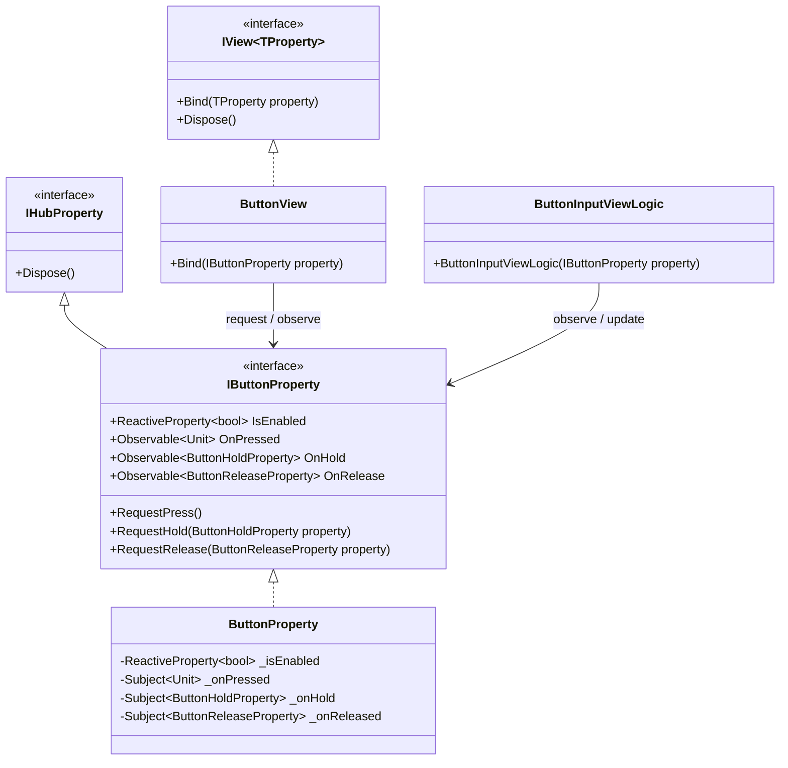
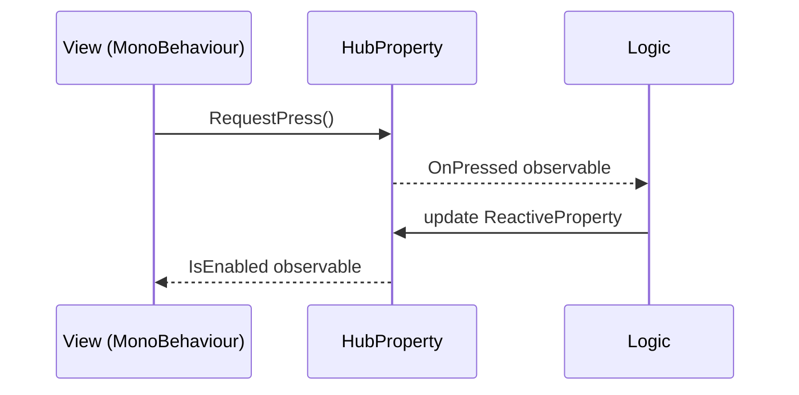

# Logic View Hub

Japanese documentation: [doc/README.ja.md](doc/README.ja.md)

Architecture Logic-View-Hub package for Unity.

## Architecture

Logic View Hub is close to a Model-View-ReactiveProperty style, but it avoids the word `Model` because Unity game projects often use it for other meanings. In this package, `Logic` owns behavior, `View` owns Unity presentation, and `HubProperty` is the communication contract between them.

- `Logic`: Pure behavior layer. It receives a derived HubProperty interface through its constructor and does not directly operate Unity Views.
- `View`: Unity presentation layer. It is built with `MonoBehaviour` and binds to a HubProperty interface.
- `HubProperty`: Message and state hub. It defines `ReactiveProperty` values and request/observable event pairs only. It should not contain game logic.





The important rule is that `Logic` and `View` both depend on the HubProperty interface. `Logic` should not hold or call a concrete View.

## Development

Open `Dev-Logic-View-Hub` as a Unity project.

The package source is placed in `package/`. The Unity project references it through a symbolic link:

```text
Dev-Logic-View-Hub/Assets/Logic-View-Hub -> ../../package
```

Samples are placed in `package/Samples~` so Unity Package Manager treats them as package samples. For development, `Dev-Logic-View-Hub/Assets/Samples` links to that folder.

## Setup

Create the symbolic links before opening the development project in Unity.

On Windows, enable Developer Mode first:

```text
Settings > System > For developers > Developer Mode
```

Then run the following commands manually in PowerShell:

```powershell
cd D:\Github\unity-library\Library\unity-logic-view-hub\Dev-Logic-View-Hub\Assets
New-Item -ItemType SymbolicLink -Path Logic-View-Hub -Target ..\..\package
New-Item -ItemType SymbolicLink -Path Samples -Target ..\..\package\Samples~
```

If Developer Mode is disabled, run PowerShell as Administrator.

## Package

```text
package/
+-- Editor
+-- Runtime
+-- Samples~
+-- package.json
+-- README.md
+-- CHANGELOG.md
```
