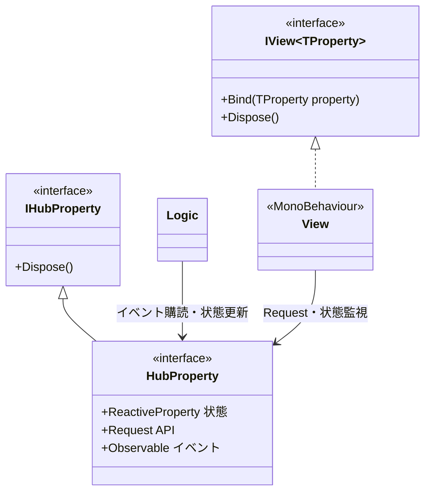
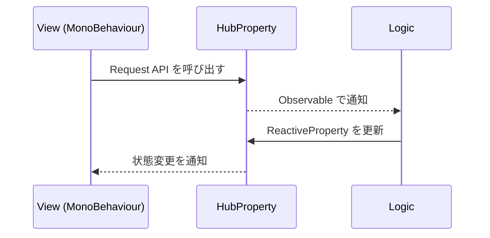
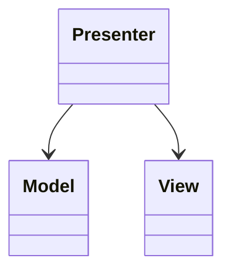
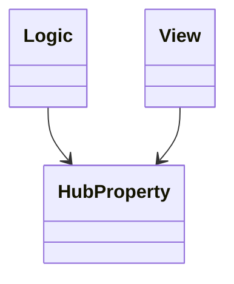
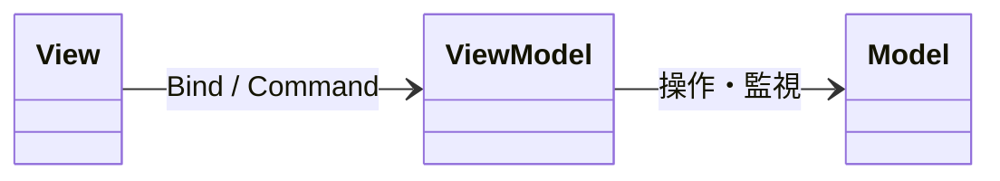
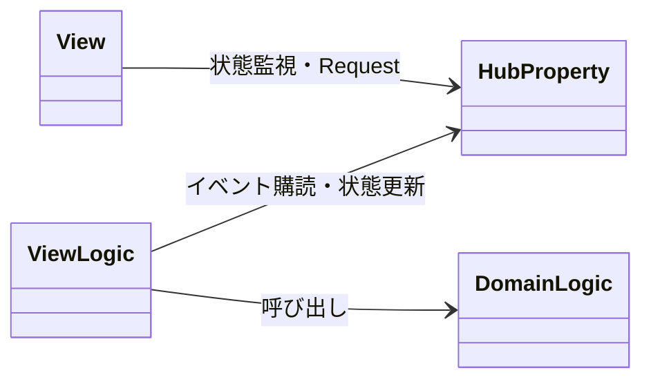
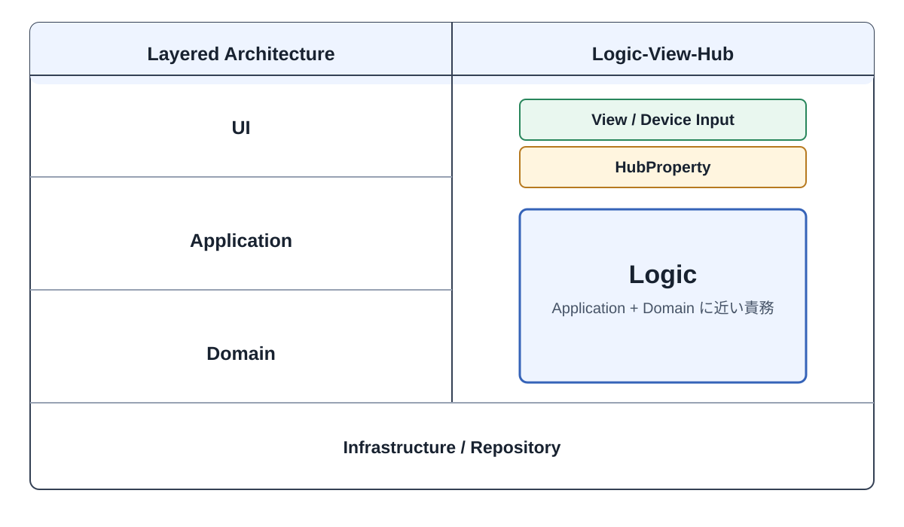
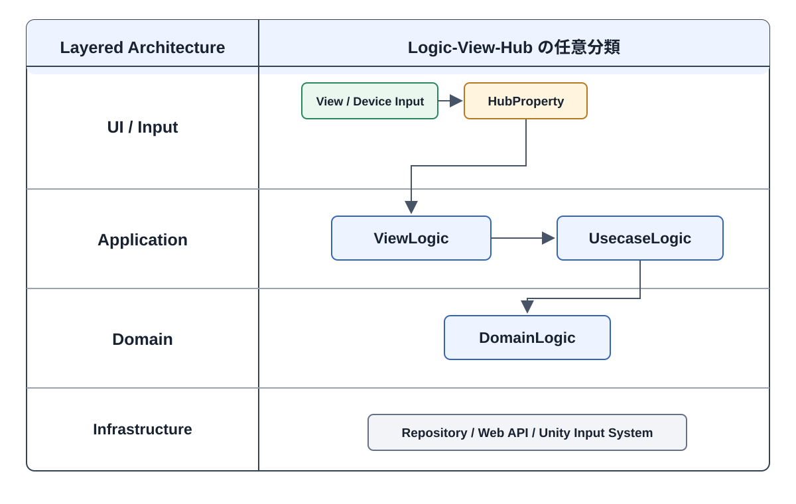

# Logic View Hub

Unity 向けの Logic-View-Hub アーキテクチャパッケージです。

## アーキテクチャ

Logic View Hub は Model-View-ReactiveProperty に近い設計ですが、Unity のゲーム開発では `Model` が別の意味で使われることが多いため、このパッケージでは振る舞いを `Logic`、Unity 側の表示や入力を `View`、両者のやりとりを `HubProperty` と呼びます。

| 構成要素 | 責務 |
| --- | --- |
| `Logic` | 振る舞いを担当します。`IHubProperty` 派生インターフェースをコンストラクタで受け取り、その HubProperty に対する操作やイベント購読を行います。View への参照は持たず、View の存在を意識しません。 |
| `View` | Unity の表示と入力を担当します。`MonoBehaviour` 派生クラスとして構築し、`IHubProperty` 派生インターフェースを Bind して、パラメータ変更イベントの購読やイベント発火 API の呼び出しを行います。 |
| `HubProperty` | Logic と View の通信口です。`ReactiveProperty` による状態と、Request API / `Observable` によるイベントを定義します。原則としてゲームロジックは持ちませんが、値の Validation がその HubProperty 内で自己完結する場合は持たせることがあります。 |





重要なルールは、`Logic` と `View` の両方が HubProperty interface に依存することです。`Logic` は具体的な View を保持したり、直接呼び出したりしません。

### MV(R)P との違い

MV(R)P では、Presenter が Model と View の両方を参照し、入力処理や状態の反映を仲介します。



Logic View Hub では、Hub は Logic や View を参照しません。Logic と View が共通の HubProperty interface を参照します。



Hub の主な責務は、次の状態とイベントを公開することです。

- View へ公開する状態（`ReactiveProperty`）
- UI 入力を受け付ける Request API
- Logic や View がイベントを購読するための `Observable`

原則としてそれ以外のロジックは持ちませんが、値の Validation がその HubProperty 内で自己完結する場合は持たせることがあります。

Presenter が担う処理は Logic 側へ分離します。
Logic の中のクラスを `DomainLogic` と `ViewLogic` に分類し、`DomainLogic` がゲームやアプリケーションのルールを、`ViewLogic` が UI 入力の処理や `DomainLogic` の呼び出しを担当します。

つまり、Presenter を Hub に置き換えるのではありません。**Presenter のロジックを Logic へ、状態とイベントの定義を Hub へ分割する**ことが主な違いです。

### MVVM との違い

MVVM では、ViewModel が View に公開する状態や Command を定義し、Model の呼び出しや表示用データへの変換も担当します。



Logic View Hub では、ViewModel に集まりやすい「状態とイベントの定義」と「それらを更新するロジック」を Hub と Logic に分割します。



Hub は ViewModel のうち、View へ公開する状態、Request API、購読可能なイベントだけを定義します。値の計算、条件分岐、Model の操作などのロジックは、Hub 内で自己完結する値の Validation を除いて持ちません。そのため、Hub は ViewModel そのものではなく、**ViewModel から状態とイベントの定義を分離したもの**に近い存在です。

責務のおおまかな対応は次のとおりです。

| MVVM | Logic View Hub |
| --- | --- |
| Model | `Logic`（`DomainLogic`） |
| ViewModel の処理ロジック | `Logic`（`ViewLogic`） |
| ViewModel の状態・Command | `HubProperty` |
| View | View |

View は Hub の状態変更を監視して表示を更新し、UI 入力時には Request API を呼び出します。`ViewLogic` はそのイベントを受け取り、必要に応じて `DomainLogic` を呼び出して Hub の状態を更新します。`ViewLogic` は View を直接参照しません。

この分割により、Hub は通信のエンドポイントとして単純に保たれ、View 固有の処理とドメインの処理も Logic 内で明確に分けられます。

### DDD の Layered Architecture との関係

Logic View Hub は、DDD の Layered Architecture をそのまま採用するものではありません。

Application 層と Domain 層を適切に分離するには、対象となるドメインを理解し、変化する要件に合わせて境界を判断し続ける必要があります。実務では、その境界を開発の初期段階から適切に設計できるチームやエンジニアは限られます。そのため LVH は、最初から厳密な層分けを要求せず、まず Unity の表現を `View`、振る舞いを `Logic`、両者の通信を `HubProperty` として分離します。

LVH における `Logic` は、DDD の特定の層を表す名前ではありません。**何らかの振る舞いを実装するクラスの大分類**です。

#### LVH の基本的な分け方

Layered Architecture と並べると、LVH の `Logic` は Application 層と Domain 層に近い責務をまとめた、大きな分類として表せます。LVH を使い始める時点では、この 2 層の境界を必須にしません。



画面上の UI とコントローラーなどのデバイス入力は別の入力体系ですが、どちらも外部から Hub の Request API を呼び出す最外層の入力です。`HubProperty` は Logic と View の双方が参照する、LVH の共有 Contract です。Entity やドメインモデルではなく、DDD の特定の層への配置も規定しません。

#### Layered Architecture に対応させる場合

プロジェクトの規模が大きくなった場合や、Application 層と Domain 層の境界が明確になった場合は、`Logic` を次のサブカテゴリへ分割できます。

- `ViewLogic`：UI やデバイス入力を受け取り、View 向け状態への変換や `UsecaseLogic` の呼び出しを担当します。
- `UsecaseLogic`：ユースケースの進行や、複数の処理の調整を担当します。
- `DomainLogic`：ゲームやアプリケーション固有のルールを担当します。



| Layered Architecture | Logic のサブカテゴリ |
| --- | --- |
| UI 層 | なし（`View`、Device Input Adapter、`HubProperty`） |
| Application 層 | `ViewLogic`、`UsecaseLogic` |
| Domain 層 | `DomainLogic` |
| Infrastructure 層 | Logic の分類対象外となる具体実装 |

この対応は必須ではありません。`ViewLogic`、`UsecaseLogic`、`DomainLogic` は独立したレイヤーを強制する型ではなく、Logic 内の責務を理解しやすくするための分類です。

## 依存パッケージ

このパッケージは R3 の Unity 向けフレーム監視機能を利用します。`Observable.EveryUpdate()` などを使うため、Unity プロジェクト側に `R3.Unity` を `com.cysharp.r3` として追加してください。

```json
{
  "dependencies": {
    "com.cysharp.r3": "https://github.com/Cysharp/R3.git?path=src/R3.Unity/Assets/R3.Unity#1.3.1"
  }
}
```

`R3.Unity` が無い場合、`ObservableSystem.DefaultFrameProvider is not set` という例外が発生します。

## 開発

`Dev-Logic-View-Hub` を Unity プロジェクトとして開きます。

パッケージ本体は `package/` に配置しています。Unity 開発プロジェクト内では、次のシンボリックリンク経由で参照します。

```text
Dev-Logic-View-Hub/Assets/Logic-View-Hub -> ../../package
```

Samples は Unity Package Manager の sample として扱うため `package/Samples~` に配置しています。開発中は `Dev-Logic-View-Hub/Assets/Samples` からそのフォルダへリンクします。

## セットアップ

Unity で開く前にシンボリックリンクを作成します。

Windows では先に Developer Mode を有効化します。

```text
Settings > System > For developers > Developer Mode
```

その後、PowerShell で次を実行します。

```powershell
cd D:\Github\unity-library\Library\unity-logic-view-hub\Dev-Logic-View-Hub\Assets
New-Item -ItemType SymbolicLink -Path Logic-View-Hub -Target ..\..\package
New-Item -ItemType SymbolicLink -Path Samples -Target ..\..\package\Samples~
```

Developer Mode が無効な場合は、PowerShell を管理者として実行してください。

## パッケージ構成

```text
package/
+-- Editor
+-- Runtime
+-- Samples~
+-- package.json
+-- README.md
+-- CHANGELOG.md
```
