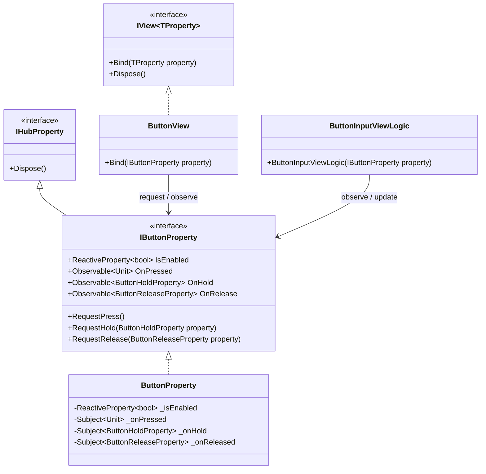
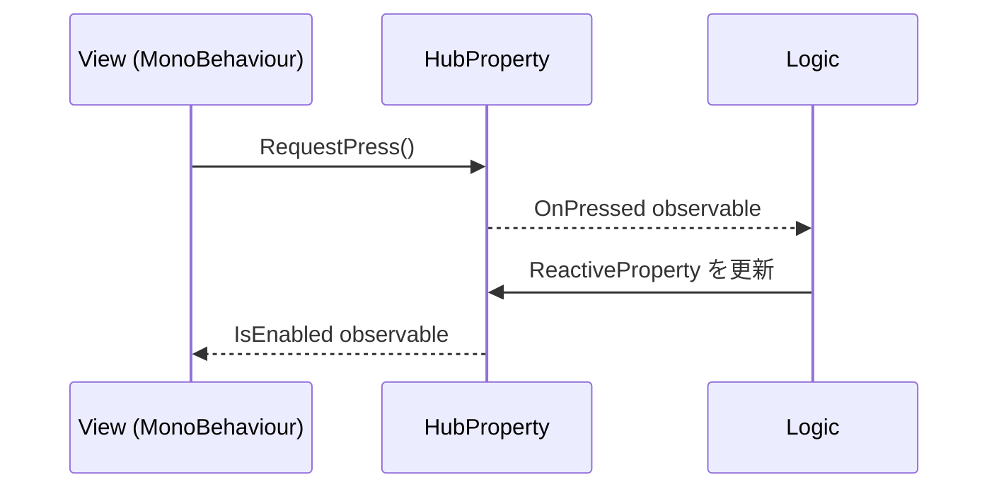

# Logic View Hub

Unity 向けの Logic-View-Hub アーキテクチャパッケージです。

## アーキテクチャ

Logic View Hub は Model-View-ReactiveProperty に近い設計ですが、Unity のゲーム開発では `Model` が別の意味で使われることが多いため、このパッケージでは振る舞いを `Logic`、Unity 側の表示や入力を `View`、両者のやりとりを `HubProperty` と呼びます。

- `Logic`: 振る舞いを担当する層です。派生した HubProperty interface をコンストラクタなどで受け取り、Unity の View を直接操作しません。
- `View`: Unity 表現を担当する層です。`MonoBehaviour` 派生クラスとして構築し、HubProperty interface に Bind します。
- `HubProperty`: Logic と View の通信口です。`ReactiveProperty` による状態定義と、Request API / Observable のイベント定義のみを書きます。ゲームロジックは書きません。





重要なルールは、`Logic` と `View` の両方が HubProperty interface に依存することです。`Logic` は具体的な View を保持したり、直接呼び出したりしません。

## 依存パッケージ

このパッケージは R3 の Unity 向けフレーム監視機能を利用します。`Observable.EveryUpdate()` などを使うため、Unity プロジェクト側に `R3.Unity` を `com.cysharp.r3` として追加してください。

```json
{
  "dependencies": {
    "com.cysharp.r3": "https://github.com/Cysharp/R3.git?path=src/R3.Unity/Assets/R3.Unity#1.3.1"
  }
}
```

`R3.Unity` が無い場合、`ObservableSystem.DefaultFrameProvider is not set` という例外が発生します。

## 開発

`Dev-Logic-View-Hub` を Unity プロジェクトとして開きます。

パッケージ本体は `package/` に配置しています。Unity 開発プロジェクト内では、次のシンボリックリンク経由で参照します。

```text
Dev-Logic-View-Hub/Assets/Logic-View-Hub -> ../../package
```

Samples は Unity Package Manager の sample として扱うため `package/Samples~` に配置しています。開発中は `Dev-Logic-View-Hub/Assets/Samples` からそのフォルダへリンクします。

## セットアップ

Unity で開く前にシンボリックリンクを作成します。

Windows では先に Developer Mode を有効化します。

```text
Settings > System > For developers > Developer Mode
```

その後、PowerShell で次を実行します。

```powershell
cd D:\Github\unity-library\Library\unity-logic-view-hub\Dev-Logic-View-Hub\Assets
New-Item -ItemType SymbolicLink -Path Logic-View-Hub -Target ..\..\package
New-Item -ItemType SymbolicLink -Path Samples -Target ..\..\package\Samples~
```

Developer Mode が無効な場合は、PowerShell を管理者として実行してください。

## パッケージ構成

```text
package/
+-- Editor
+-- Runtime
+-- Samples~
+-- package.json
+-- README.md
+-- CHANGELOG.md
```
