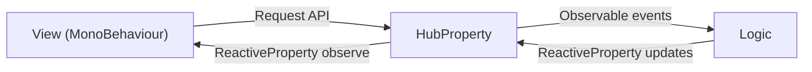

# CovaGame Logic View Hub

Architecture Logic-View-Hub package for Unity.

## Architecture

Logic View Hub separates Unity presentation from game behavior through a shared HubProperty contract.

- `Logic`: behavior layer. It receives a derived HubProperty interface and does not directly operate Views.
- `View`: `MonoBehaviour` layer. It binds to a HubProperty interface and sends user requests.
- `HubProperty`: communication hub. It defines `ReactiveProperty` values and request/observable event pairs only.



`HubProperty` is intentionally not a logic layer. It is the boundary that keeps `Logic` from directly controlling `View`.

## Installation

Add this package through the configured Unity scoped registry.

This package uses R3 frame-based observables in Unity. Install `R3.Unity` in the Unity project as `com.cysharp.r3` before using samples or any code that calls `Observable.EveryUpdate()`.

```json
{
  "dependencies": {
    "com.cysharp.r3": "https://github.com/Cysharp/R3.git?path=src/R3.Unity/Assets/R3.Unity#1.3.1"
  }
}
```

```json
{
  "dependencies": {
    "jp.covagame.logic-view-hub": "0.1.1"
  }
}
```
